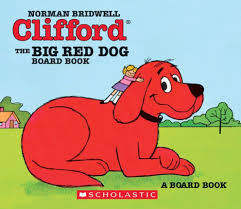

# About Mr. Clifford

* Name: Mr. Clifford
* Graduated from BHS: 2012
* Graduated from UMas Amherst: 2016

# Summary

Hello World! I am Mr. Clifford. I am a Comptuer Science teacher at Brockton High School. I am also the Web Content Manager for Brockton Public Schools.

Outside of work, I love to learn expand my knowledge of programming. I took the Udacity Blockchain Developer Nanadegree course and earned my certificate. I also love to workout. I try to make it ot the gym 5 timea a week. The gym is a healthy way for me to relieve stress. My favorite sport is soccer and my favorite team is Manchester United. But of course, I love my New England TEams (Patriots, Red Sox, and Bruins)

...and I love Pixar!

# Family

Family is very impoertant to me. My parents worked hard their whole life to make sure my brothers and I had a good life. I have two brotheres, one older and one younger (yes, that makes me the middle child). We have lived all over Brockton, MA.

Like I said, my parents are so hard working. My dad was a Marine and a Police Officer and my omom is an Emergency Room Nurse. My older brother lives in Berkely, CA and is a developer. My younger brother workds at East Middle School.

# Skills

* 4 time hoola hoop champion
* Blockchain Developer
* Python
* JavaScript (Node.js)
* HTML/CSS

# Hobbies

* Soccer
* Working Out
* Swimming
* Running
* Netflix

# My Favorite Books

1. Hoe to Win Friends & Influence People by Dale Carnegie
1. Creativity, Inc.: Overciming the Unseen Forces That Stand in the Way of True Inspiration by Ed Catmull
1. Outliers: The Story of Success by Malcolm Gladwell
