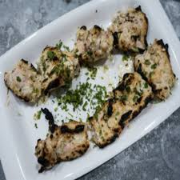

# About

This is one of my favorite foods that I like to have occasionally. Its a delicious food that is good for lunch and dinner. The finished product is shown below

* **Prep Time**: 4 Hours
* **Cook Time**: 30 Minutes
* **Total Time**: 4 Hours 30 Minutes
* **Servings**: 3 to 4
* **Total Cost**: <$57.25

## Ingredients

* [250 grams boneless chicken (or breast) (1/2 lb)](https://amzn.to/3agRq8L) : $4.99/pound

* [2 tbsp fresh cream](https://amzn.to/2VqKsd4) : $5.89 ($0.37 / Ounce)

* 2 tbsp [Greek Yogurt](https://amzn.to/2T86FLu) : $5.89 ($0.17 / Count), or Thick Curd or Hung Yogurt

* 1 to 1 1/2 tbsp [Lemon juice](https://amzn.to/3cb3kTn) : $3.85 ($1.54 / Ounce)

* 1/2 tsp [Ground Pepper](https://amzn.to/2T5ShTO) : $9.32 ($0.58 / Ounce)

* 2 tbsps [Chopped Cilantro](https://amzn.to/2TaWHch) : 3.65 (Or coriander leaves)

* 1 1/2 tsp [Ginger Garlic Paste](https://amzn.to/2I0kp4q) : $3.99 ($2.43 / Ounce), or 1 inch ginger 3 to 4 cloves garlic

* 1/2 tsp [Salt](https://amzn.to/39avH1Q) : $3.69 ($0.08 / Ounce)

* 5 [Almonds](https://amzn.to/2I7FIRu) : $7.99 ($0.80 / Ounce)

* 8 [Cashewnuts](https://amzn.to/2Pxd0h0) : $7.99 ($0.80 / Ounce)

## Directions

### Preparation for chicken Malai Kabab

1. Add chicken to a bowl
1. If using cheese, then mix together all the ingredients. If using nuts instead of cheese, then add almonds, cashews wtih cream and yogurt to a blender jar. Make a smooth paste.
1. Add this to the chicken
1. Mix together and marinate in the refrigerator for about 4 hours to overnight

### How to make Malai Kabab

1. Preheat the oven to 240 Celcius for at least **15 minutes**.
1. Put them on skewers. Grill them for **15 minutes**.
1. Flop the skewwers and grill for another **10 minutes**.
    * Keep an eye on them after 25 minutes of grilling to prevent burning.

## Original Source

[Indian Healthy Recipes](https://www.indianhealthyrecipes.com/murgh-malai-kabab-reshmi-kabab/)
