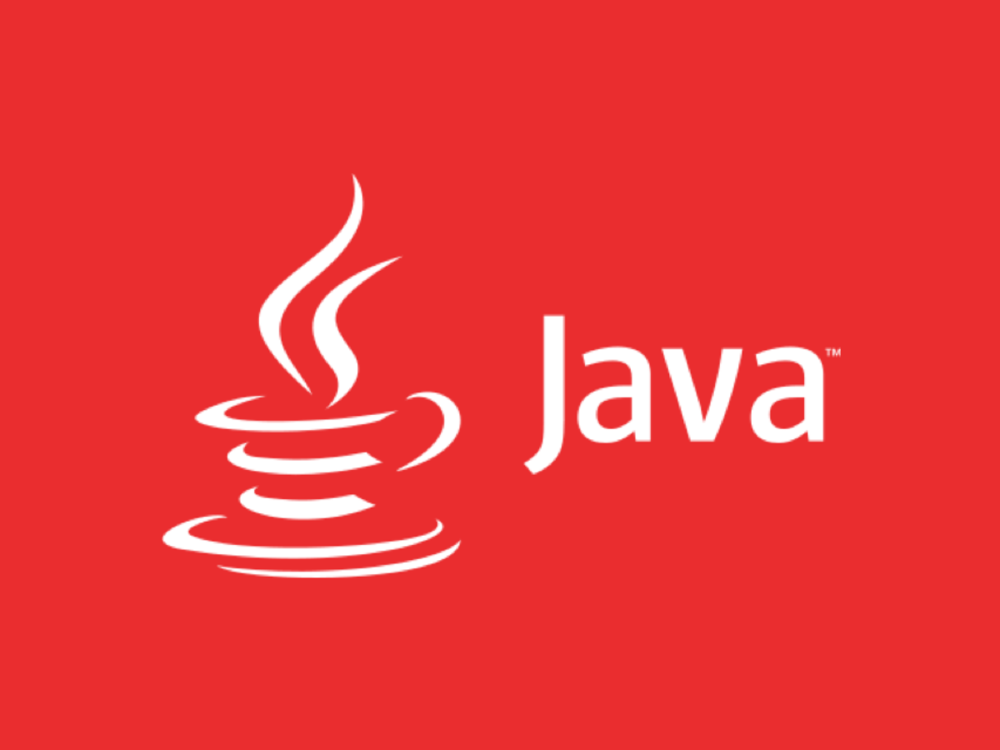
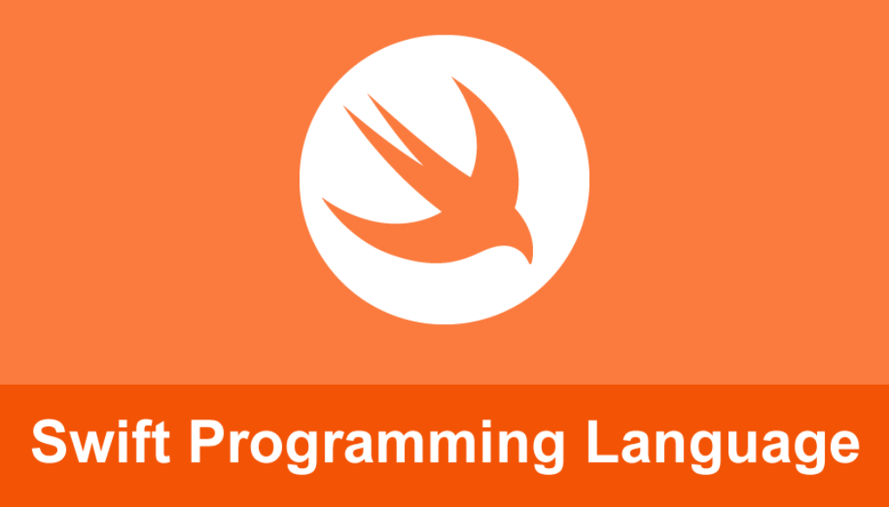
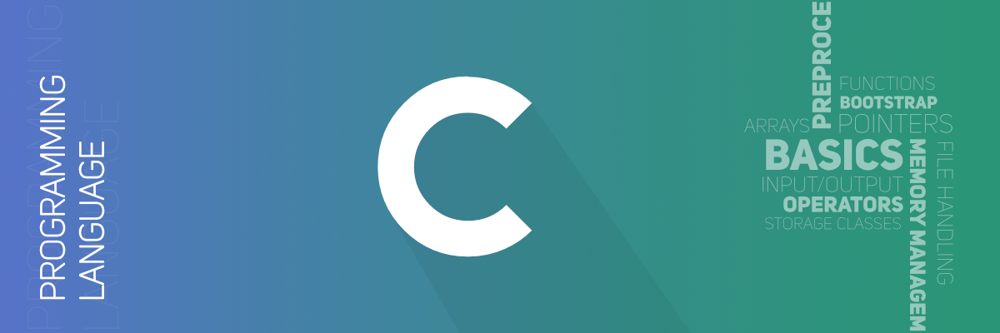
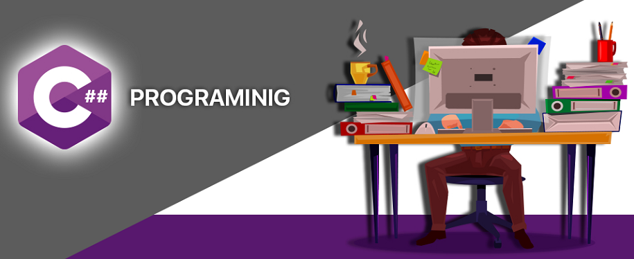
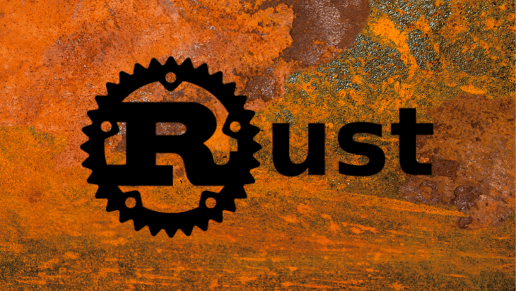

# Basic Terminology

Source: [programmingforbeginnersbook.com](https://www.programmingforbeginnersbook.com/blog/expand_your_programming_vocabulary/)

* **Variable**: A container that can hold a single value for later use `int x = 78;`
* **Algorithm**: Step-and-step instructions you give a computer to execute
* **Argument**: A value that is passed between programs, subroutines, and/or functions.
* **Array**: A sequence of values: `int arr = { 1, 2, 3,... };`
* **Assignment**: To put values into variables: `int x = 5;`
* **Bug**: A misatke in a program
* **Call**: To run a function and the code inside it
* **Comment**: Code that is ignored by the compiler and is used for documenting code for humans which is very handy until that one guy doesn't document their code and you're just sitting there trying to figure out what `sdlki_sy5_bin` does for 7 hours straight.
* **Class**: A type that a programmer can define and create objects of that class
* **Object**: A value created from a class. If you were to represent your family in code, you'd name a class called something like `FamilyMember`, and then make objects of that class – one object for each person in your family. Objects usually contain other values inside instance variables, and have methods attached to them, for example each `FamilyMember` object might have a `name` instance variable. Objects combine the concept of variables and functions into a single value. Also known as an instance.
* **Object-Oriented**: Designed using objects
* **Read**: To retrieve input-data values from an external source like another file
* **Return**: To stop a function call from running and can return a value if programmed to do so. It does this automatically once it has run all of its code.
* **Return Value**: The value that results from the completion of a function call
* **Run**: To perform the instructions written in your program, usually as an executable
* **Syntax**: The grammar of the language
* **Type**: The kind oor category of a value (Examples below)
    1. The number `5` is an `Integer`
    1. The number `5.7298463710` is a float
    1. A double is basically the same as a float but it can hold twice as many decimals

## Common Programming Languages

### Python


> Python is an interpreted, high-level, general-purpose programming language. Created by Guido van Rossum and first released in 1991, Python's design philosophy emphasizes code readability with its notable use of significant whitespace.

Python is a high-level language that is fairly easy for beginners that are starting to get into programming.

```python
#A Hello World program in Python
print("Hello world!")
```

### Java



> Java is a general-purpose programming language that is class-based, object-oriented, and designed to have as few implementation dependencies as possible.

Java is a high-level language that is object oriented and is able to work on all operating systems, could probably even work on your toaster!

```java
//A Hello World program in Java
class HelloWorld {
    public static void main(String []args) {
        System.out.println("Hello world!");
    }
}
```

### C++


> C++ is a high-level, general-purpose programming language created by Bjarne Stroustrup as an extension of the C programming language, or "C with Classes".

```c++
#include <iostream>
using namespace std;

//A Hello World program in C++
int main() {
    cout << "Hello world!" << endl;
}
```

### JavaScript

### Swift



> Swift is a general-purpose, multi-paradigm, compiled programming language developed by Apple Inc. for iOS, iPadOS, macOS, watchOS, tvOS, Linux, and z/OS. Swift is designed to work with Apple's Cocoa and Cocoa Touch frameworks and the large body of existing Objective-C code written for Apple products.

```swift
import Swift
print("Hello world!")
```

### C



> C is a general-purpose, procedural computer programming language supporting structured programming, lexical variable scope, and recursion, while a static type system prevents unintended operations.

```c
#include <stdio.h>
#include <stdlib.h>

//A Hello World program in C
int main() {
    printf("Hello world!");
}
```

### C# (a.k.a C Sharp)



> C# is a general-purpose, multi-paradigm programming language encompassing strong typing, lexically scoped, imperative, declarative, functional, generic, object-oriented, and component-oriented programming disciplines.

```csharp
using System;
using System.Collections.Generic;
using System.Linq;
using System.Text;
using System.Threading.Tasks;

//A Hello World program in C#
namespace ConsoleApp1 {
    class Program {
        static void Main(string[] args) {

        }
    }
}
```

### Rust



> Rust is a multi-paradigm programming language focused on performance and safety, especially safe concurrency. Rust is syntactically similar to C++, but provides memory safety without using garbage collection.

```rust

//A Hello World program in Rust
fn main() {
    println("Hello world!");
}
```
